# Informações do Projeto
`TÍTULO DO PROJETO`  

Dificuldade dos jovens em entender as áreas de TI.

`CURSO` 

Engenharia de Software.

## Participantes
> Os membros do grupo são: 
> - Gabriel Herolt Araújo. 
> - Mellyssa Meireles Dos Santos.
> - Miguel Alves Fernandes Moraes.

# Estrutura do Documento

- [Informações do Projeto](#informações-do-projeto)
  - [Participantes](#participantes)
- [Estrutura do Documento](#estrutura-do-documento)
- [Introdução](#introdução)
  - [Problema](#problema)
  - [Objetivos](#objetivos)
  - [Justificativa](#justificativa)
  - [Público-Alvo](#público-alvo)
- [Especificações do Projeto](#especificações-do-projeto)
  - [Personas e Mapas de Empatia](#personas-e-mapas-de-empatia)
  - [Histórias de Usuários](#histórias-de-usuários)
  - [Requisitos](#requisitos)
    - [Requisitos Funcionais](#requisitos-funcionais)
    - [Requisitos não Funcionais](#requisitos-não-funcionais)
  - [Restrições](#restrições)
- [Projeto de Interface](#projeto-de-interface)
  - [User Flow](#user-flow)
  - [Wireframes](#wireframes)
- [Metodologia](#metodologia)
  - [Divisão de Papéis](#divisão-de-papéis)
  - [Ferramentas](#ferramentas)
  - [Controle de Versão](#controle-de-versão)
- [**############## SPRINT 1 ACABA AQUI #############**](#-sprint-1-acaba-aqui-)
- [Projeto da Solução](#projeto-da-solução)
  - [Tecnologias Utilizadas](#tecnologias-utilizadas)
  - [Arquitetura da solução](#arquitetura-da-solução)
- [Avaliação da Aplicação](#avaliação-da-aplicação)
  - [Plano de Testes](#plano-de-testes)
  - [Ferramentas de Testes (Opcional)](#ferramentas-de-testes-opcional)
  - [Registros de Testes](#registros-de-testes)
- [Referências](#referências)

# Introdução

## Problema

O problema apresentado é sobre a dificuldade dos jovens em entender as áreas de TI, que ingressaram na faculdade ou até mesmo que estão em duvida de qual área começar. O contexto da aplicação irá ser usado para os jovens que ainda não tem certeza e/ou conhecimento sobre a área de TI que quer começar seus estudos.

> Nesse momento você deve apresentar o problema que a sua aplicação deve
> resolver. No entanto, não é a hora de comentar sobre a aplicação.
> Descreva também o contexto em que essa aplicação será usada, se
> houver: empresa, tecnologias, etc. Novamente, descreva apenas o que de
> fato existir, pois ainda não é a hora de apresentar requisitos
> detalhados ou projetos.
>
> Nesse momento, o grupo pode optar por fazer uso
> de ferramentas como Design Thinking, que permite um olhar de ponta a
> ponta para o problema.
>
> **Links Úteis**:
> - [Objetivos, Problema de pesquisa e Justificativa](https://medium.com/@versioparole/objetivos-problema-de-pesquisa-e-justificativa-c98c8233b9c3)
> - [Matriz Certezas, Suposições e Dúvidas](https://medium.com/educa%C3%A7%C3%A3o-fora-da-caixa/matriz-certezas-suposi%C3%A7%C3%B5es-e-d%C3%BAvidas-fa2263633655)
> - [Brainstorming](https://www.euax.com.br/2018/09/brainstorming/)

## Objetivos

Como objetivo geral, nosso trabalho é desenvolver um software como um teste vocacional para auxiliar o jovem a entender as aréas de TI e direciona-lo para a área de TI que mais se identifica. Nossa prática consiste em fazer perguntas estratégicas ao usuário sobre quais atividades ele mais se adequa, para no final apresenta-lo qual seria a área com maior conforto e desenvolvimento para o usuário.

> Aqui você deve descrever os objetivos do trabalho indicando que o
> objetivo geral é desenvolver um software para solucionar o problema
> apresentado acima. Apresente também alguns (pelo menos 2) objetivos
> específicos dependendo de onde você vai querer concentrar a sua
> prática investigativa, ou como você vai aprofundar no seu trabalho.
> 
> **Links Úteis**:
> - [Objetivo geral e objetivo específico: como fazer e quais verbos utilizar](https://blog.mettzer.com/diferenca-entre-objetivo-geral-e-objetivo-especifico/)

## Justificativa
Por conta dos integrantes terem passado pelo mesmo problema, foi uma motivação para trabalhar com esta aplicação,com objetivo de auxiliar os jovens a entender qual a área certa para eles.

> Descreva a importância ou a motivação para trabalhar com esta aplicação
> que você escolheu. Indique as razões pelas quais você escolheu seus
> objetivos específicos ou as razões para aprofundar em certos aspectos
> do software.
> 
> O grupo de trabalho pode fazer uso de questionários, entrevistas e
> dados estatísticos, que podem ser apresentados, com o objetivo de
> esclarecer detalhes do problema que será abordado pelo grupo.
>
> **Links Úteis**:
> - [Como montar a justificativa](https://guiadamonografia.com.br/como-montar-justificativa-do-tcc/)

## Público-Alvo

Os principais alvos da nossa aplicação são os jovens de de 14 a 25 anos que podem ou não ter ingressado na faculdade com dificuldades em escolher o curso certo, ou que ja escolheram um curso e não se identificaram com o curso. 
> Descreva quem serão as pessoas que usarão a sua aplicação indicando os
> diferentes perfis. O objetivo aqui não é definir quem serão os
> clientes ou quais serão os papéis dos usuários na aplicação. A ideia
> é, dentro do possível, conhecer um pouco mais sobre o perfil dos
> usuários: conhecimentos prévios, relação com a tecnologia, relações
> hierárquicas, etc.
>
> Adicione informações sobre o público-alvo por meio de uma descrição
> textual, ou diagramas de personas, mapa de stakeholders, ou como o
> grupo achar mais conveniente.
> 
> **Links Úteis**:
> - [Público-alvo: o que é, tipos, como definir seu público e exemplos](https://klickpages.com.br/blog/publico-alvo-o-que-e/)
> - [Qual a diferença entre público-alvo e persona?](https://rockcontent.com/blog/diferenca-publico-alvo-e-persona/)
 
# Especificações do Projeto
Nessa parte do projeto, usamos várias ferramentas e técnicas para auxiliar na produção do projeto. Dentre elas são: Trello, Miro, Git, Github, Design thinking,scrum etc.

> Apresente uma visão geral do que será abordado nesta parte do
> documento, enumerando as técnicas e/ou ferramentas utilizadas para
> realizar a especificações do projeto

## Personas e Mapas de Empatia

......  COLOQUE AQUI O SEU TEXTO ......

> Relacione as personas identificadas no seu projeto e os respectivos mapas de empatia. Lembre-se que 
> você deve ser enumerar e descrever precisamente e de forma
> personalizada todos os principais envolvidos com a solução almeja. 
> 
> Para tanto, baseie-se tanto nos documentos disponibilizados na disciplina
> e/ou nos seguintes links:
>
> **Links Úteis**:
> - [Persona x Público-alvo](https://flammo.com.br/blog/persona-e-publico-alvo-qual-a-diferenca/)
> - [O que é persona?](https://resultadosdigitais.com.br/blog/persona-o-que-e/)
> - [Rock Content](https://rockcontent.com/blog/personas/)
> - [Hotmart](https://blog.hotmart.com/pt-br/como-criar-persona-negocio/)
> - [Mapa de Empatia](https://resultadosdigitais.com.br/blog/mapa-da-empatia/)
> - [Como fazer um mapa de empatia - Vídeo](https://www.youtube.com/watch?v=JlKHGpVoA2Y)
> 
> 
> **Exemplo de Persona**
> 
> 
> 
> Fonte: [Como criar uma persona para o seu negócio](https://raissaviegas.com.br/como-criar-uma-persona/)

## Histórias de Usuários

Com base na análise das personas forma identificadas as seguintes histórias de usuários:

|EU COMO... `PERSONA`| QUERO/PRECISO ... `FUNCIONALIDADE` |PARA ... `MOTIVO/VALOR`                 |
|--------------------|------------------------------------|----------------------------------------|
|Usuário do sistema  | Registrar minhas tarefas           | Não esquecer de fazê-las               |
|Administrador       | Alterar permissões                 | Permitir que possam administrar contas |

> Apresente aqui as histórias de usuário que são relevantes para o
> projeto de sua solução. As Histórias de Usuário consistem em uma
> ferramenta poderosa para a compreensão e elicitação dos requisitos
> funcionais e não funcionais da sua aplicação. Se possível, agrupe as
> histórias de usuário por contexto, para facilitar consultas
> recorrentes à essa parte do documento.
>
> **Links Úteis**:
> - [Histórias de usuários com exemplos e template](https://www.atlassian.com/br/agile/project-management/user-stories)
> - [Como escrever boas histórias de usuário (User Stories)](https://medium.com/vertice/como-escrever-boas-users-stories-hist%C3%B3rias-de-usu%C3%A1rios-b29c75043fac)

## Requisitos

As tabelas que se seguem apresentam os requisitos funcionais e não funcionais que detalham o escopo do projeto.

### Requisitos Funcionais

|ID    | Descrição do Requisito  | Prioridade |
|------|-----------------------------------------|----|
|RF-001| Cadastrar usuário | ALTA | 
|RF-002| Autenticar usuário    | ALTA |
|RF-003| Alterar usuário       | BAIXA |
|RF-004| Formulário para identificar o curso que usuário assemelha | ALTA |
|RF-005| Histórico de formulários respondidos pelo usuário         | MEDIA |
|RF-006| Permitir que o usuário favorite cursos     | BAIXA |
|RF-007| Exibir manchetes de cursos favoritados     | BAIXA |
|RF-008| Exibir manchetes do tema "Cursos de TI     | ALTA |
|RF-009| Exibir universidades que possuem cursos de TI | ALTA |
|RF-010| Permitir a filtragem de universidades por preço | MEDIA |
|RF-011| Permitir a filtragem de universidades por curso | ALTA |
|RF-012| Comparação de preços de faculdades particulares | BAIXA |

### Requisitos não Funcionais

|ID     | Descrição do Requisito  |Prioridade |
|-------|-------------------------|----|
|RNF-001| O sistema deve ser responsivo para rodar em um dispositivos móvel | MÉDIA | 
|RNF-002| Deve processar requisições do usuário em no máximo 3s |  BAIXA | 
|RNF-003| Base de dados que relaciona curso com perfil do usuário | ALTA |

## Restrições

O projeto está restrito pelos itens apresentados na tabela a seguir.

|ID| Restrição                                             |
|--|-------------------------------------------------------|
|01| O projeto deverá ser entregue até o final do semestre |
|02| Não pode ser desenvolvido um módulo de backend        |

# Projeto de Interface

 O Projeto de Interface fora feito utilizando a ferramenta de planejamento de projeto <a href=“https://miro.com/“>Miro</a>. Nesta etapa, busca-se atender os requisitos funcionais e não funcionais especificados nas [Especificações do Projeto](#especificações-do-projeto), utilizando-se dos dados coletados nas pesquisas qualitativas. Para isso, fez-se útil o User Flow, mapeando a atividade do usuário dentro da aplicação, e os wireframes, que ajudam a dar uma pré-visualização da solução a ser desenvolvida.

 

 Pensando na dificuldade do usuário em encontrar dados sobre cursos da área de TI na internet, fez-se uma prototipação focada em dar informações diretas e separadas por curso, além de uma ferramenta para auxiliar o usuário a definir qual curso melhor se encaixa ao seu perfil.

## User Flow

**User Flow Principal:**
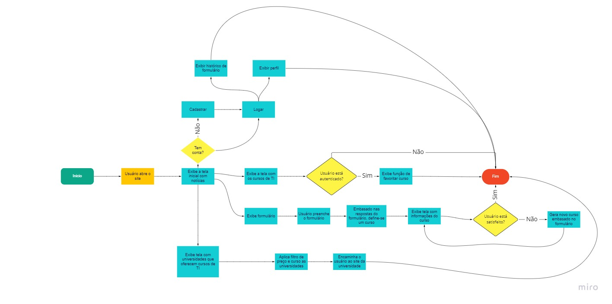

 Pelo User Flow de toda aplicação, é possivel perceber que, ao acessar o site, permite-se quatro principais caminhos: Cursos, universidades, formulário e autenticação.

 No caminho de cursos, é possivel ver uma listagem dos cursos da área de TI e, se autenticado, favoritar os que mais interessam ao usuário.

 No de universidades, são listadas universidades que oferecem os cursos da área de TI, possibilitando o usuário filtrar por curso e preço.

 No de autenticação, possuí as funções de login, cadastro e edição de perfil.

**User Flow do Formulário:**
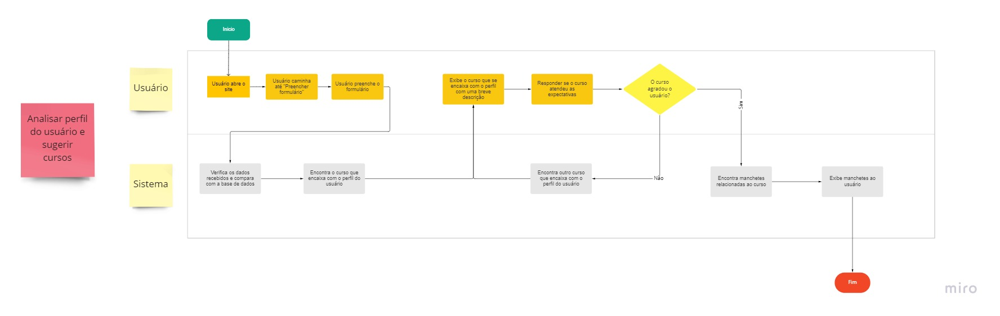

 Por ser mais extenso, fora feito um User Flow apenas para o processo de formulário. É possivel verificar que, respondidas as perguntas solicitadas, o sistema, com base nas respostas, indicará o usuário qual o curso que mais se assemelha ao seu perfil, exibindo manchetes e informações sobre. Após a leitura, o usuário poderá informar ao sistema que aquele curso não o agrada, gerando-se um novo.

## Wireframes

**Tela inicial:**
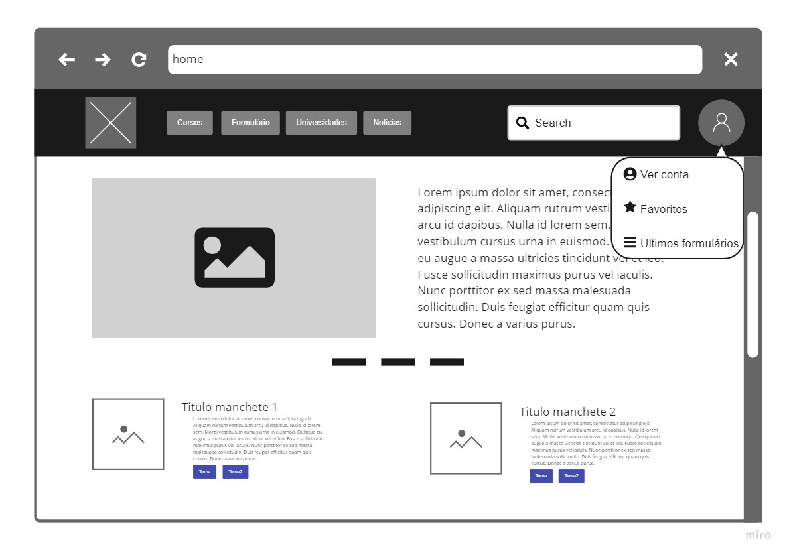

Esta é a tela inicial do projeto. Contém um header navigation, com a função de navegar por toda aplicação. A tela inicial possui um carrousel, que destacará as principais notícias da área, e manchetes sobre cursos de TI.

**Notícias**
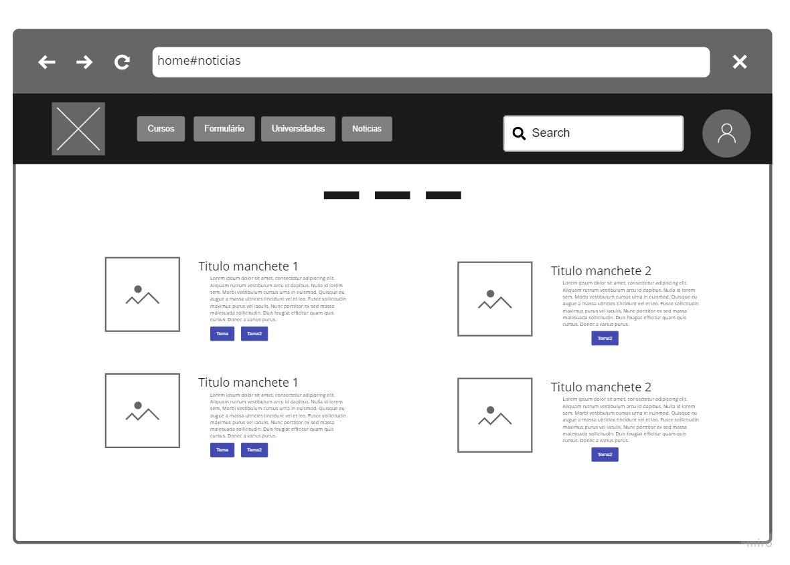

A tela de notícias ainda está dentro da tela inicial. Ao clicar no botão "Notícias" no header, o usuário será direcionado a seção de manchetes.

**Cursos**
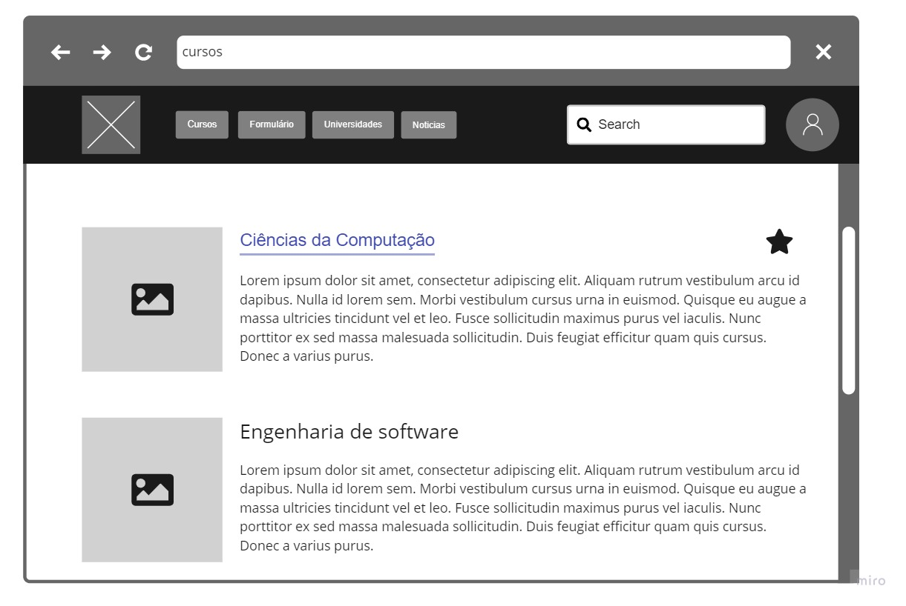

Nesta tela, acessada pelo botão "Cursos" no header, será apresentado ao usuário uma lista de cursos com uma breve descrição. O usuário pode favoritar ou desfavoritar cursos.

**Curso**
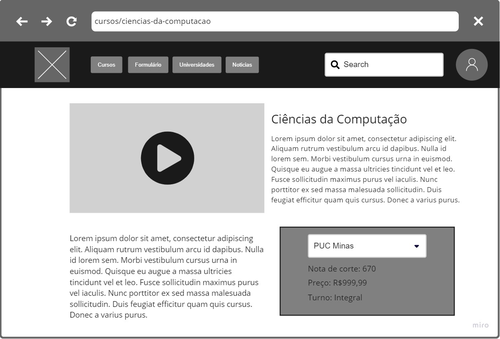

Ao selecionar um curso na tela de cursos, o usuário será redirecionado para uma nova tela, que detalhará melhor o curso escolhido e dará a opção de ver universidades que o oferecem.

**Universidades**
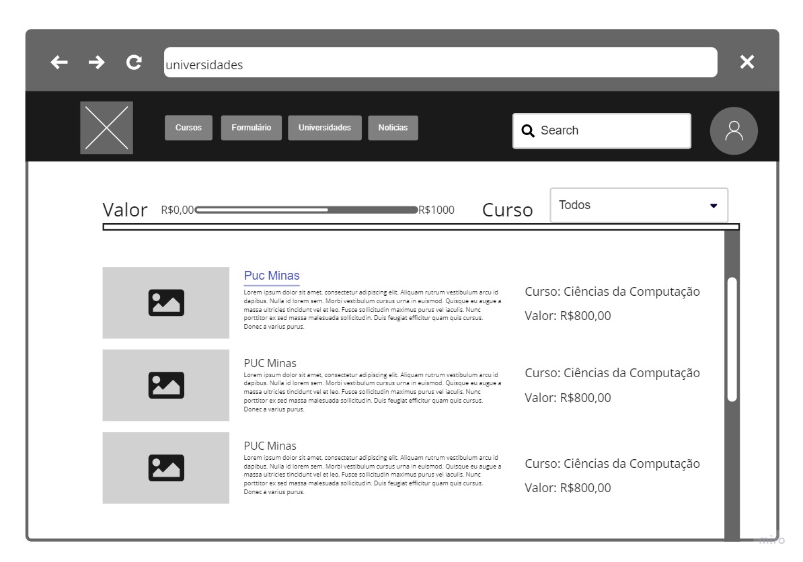

Clicando em "Universidades" do header, esta tela será exibida, listando todas universidades que oferecem cursos de TI. Também será possível filtrar as universidades exibidas por curso e preço. Ao clicar em uma universidade, o usuário será redirecionado para o site da instituição.

**Formulário**
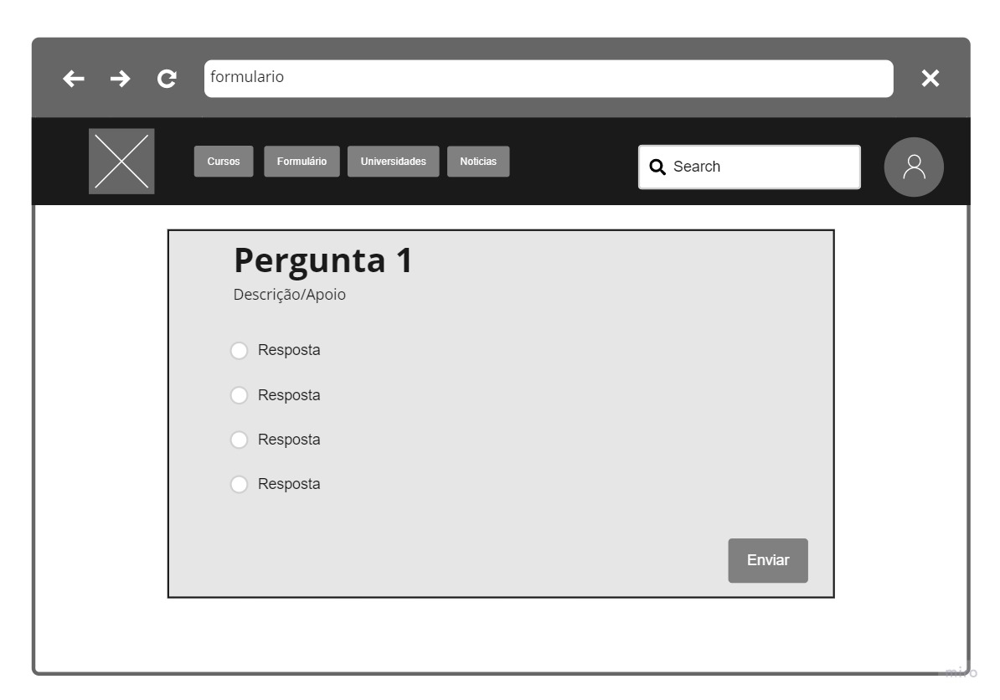

Nesta página, também acessada pelo header, o usuário responderá perguntas e, com base nas respostas, o sistema encontrará um curso que se assemelha ao perfil do usuário.

**Resultado do Formulário**
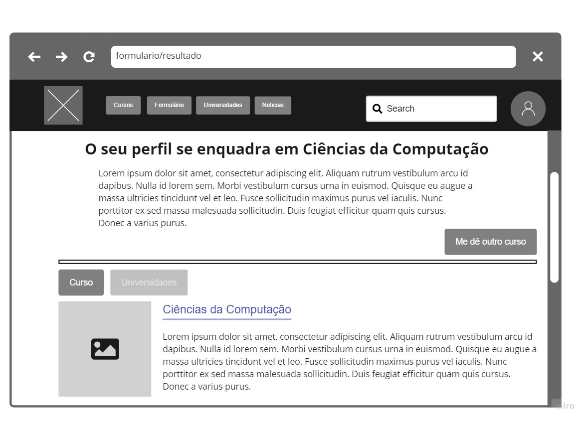

Ao preencher todo o formulario e clicar em enviar, o sistema definirá o curso que aparenta ser do gosto do usuário e o encaminhará para uma página com os dados do curso. Esses dados são: uma breve descrição e manchetes do curso ou universidades que o oferecem.

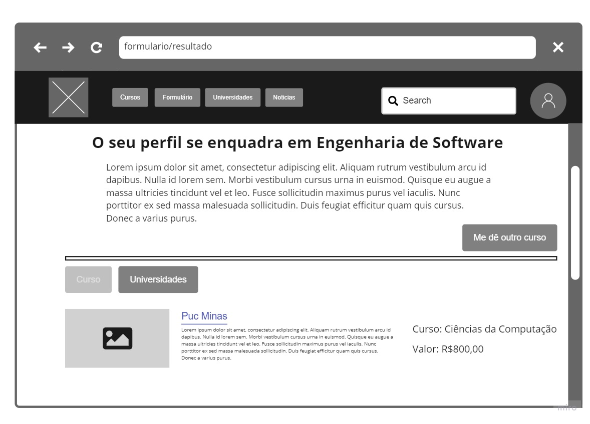

Clicando em "Me dê outro curso", o sistema retornará outro curso que se assemelha ao perfil obtido no formulário.

**Login**
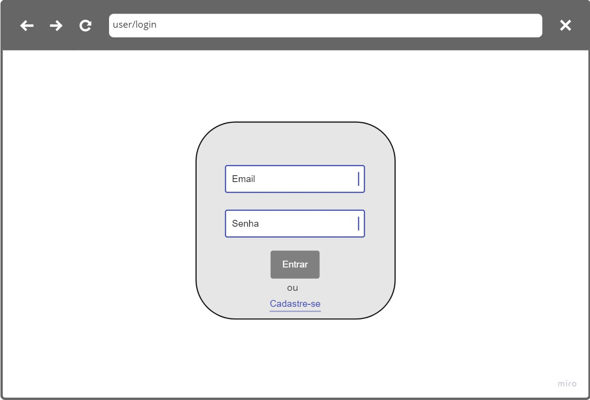

Ao clicar no botão de perfil do header, se o usuário não estiver autenticado no sistema, será redirecionado à pagina de login.

**Cadastro**
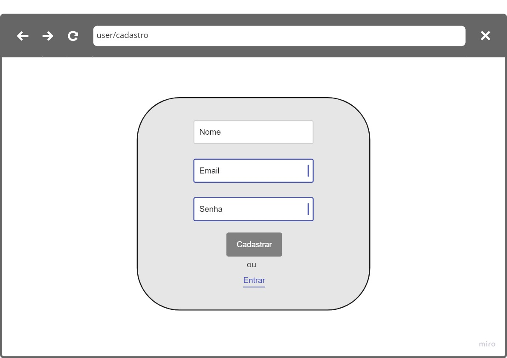

Selecionando-se "Cadastre-se" na tela de login, o usuário será redirecionado a tela de cadastro.

**Perfil**
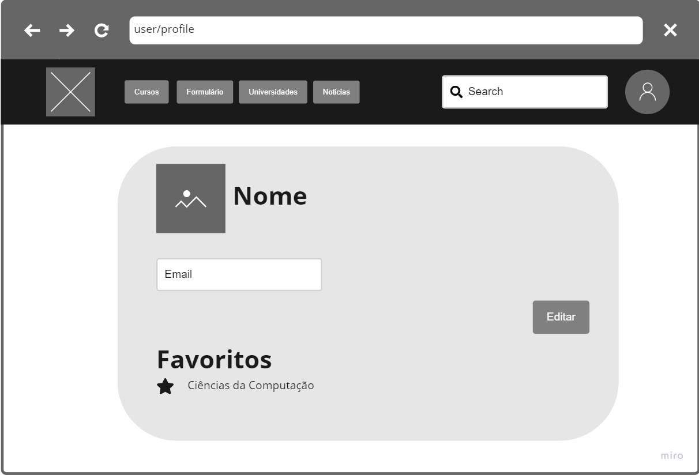

Autenticado, o usuário poderá selecionar "Ver conta" no menu de usuário. Clicando, exibirá uma tela com as informações da conta e cursos favoritados.

**Histórico**
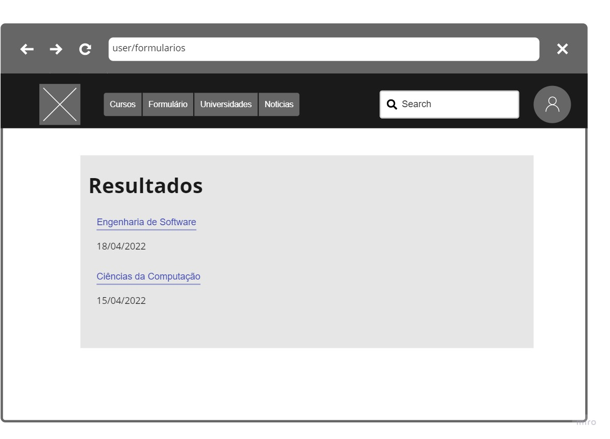

Ao selecionar "Últimos Formulários" no menu de usuário, exibirá uma tela com os ultimos resultados recebidos do formulário. Ao selecionar um, será exibido a tela "Resultado do Formulário" do curso selecionado.

# Metodologia

......  COLOQUE AQUI O SEU TEXTO ......

> Nesta parte do documento, você deve apresentar a metodologia 
> adotada pelo grupo, descrevendo o processo de trabalho baseado nas metodologias ágeis, 
> a divisão de papéis e tarefas, as ferramentas empregadas e como foi realizada a
> gestão de configuração do projeto via GitHub.
>
> Coloque detalhes sobre o processo de Design Thinking e a implementação do Framework Scrum seguido
> pelo grupo. O grupo poderá fazer uso de ferramentas on-line para acompanhar
> o andamento do projeto, a execução das tarefas e o status de desenvolvimento
> da solução.
> 
> **Links Úteis**:
> - [Tutorial Trello](https://trello.com/b/8AygzjUA/tutorial-trello)
> - [Gestão ágil de projetos com o Trello](https://www.youtube.com/watch?v=1o9BOMAKBRE)
> - [Gerência de projetos - Trello com Scrum](https://www.youtube.com/watch?v=DHLA8X_ujwo)
> - [Tutorial Slack](https://slack.com/intl/en-br/)

## Divisão de Papéis

> Apresente a divisão de papéis e tarefas entre os membros do grupo.
>
> **Links Úteis**:
> - [11 Passos Essenciais para Implantar Scrum no seu Projeto](https://mindmaster.com.br/scrum-11-passos/)
> - [Scrum em 9 minutos](https://www.youtube.com/watch?v=XfvQWnRgxG0)

## Ferramentas

 O editor de código escolhido foi o VsCode. Além de ter extensões compatíveis com HTML e CSS, possuí também ferramentas para visualizar o controle de versão e o Git Flow.

 Para comunicação, estamos utilizando o Trello. Por meio de um quadro Kanban as tarefas são dividias, permitindo que todos possam documentar o seu progresso nas tarefas.

 Na diagramação, utilizamos o Miro. Por ser uma ferramenta que possibilita a criação de fluxogramas, wireframes e outros processos de prototipação, escolhemos o Miro a fim de salvar tempo e melhorar a produtividade, uma vez que dominando a ferramenta é possivel realizar toda a etapa prototipação.

 Como hospedagem, escolhemos o Heroku, que, além de ser gratuito, permite a conexão direta com o github sem muita burocracia.

| Ambiente  | Plataforma              |Link de Acesso |
|-----------|-------------------------|---------------|
|Processo de Design Thinkgin  | Miro |  https://miro.com/app/board/uXjVOA3Il1A=/ | 
|Repositório de código | GitHub | https://github.com/ICEI-PUC-Minas-PPLES-TI/plf-es-2022-1-ti1-7946100-01-g5-entedimento-das-areas-de-ti/blob/master/docs/relatorio/Relatorio%20Tecnico%20-%20TEMPLATE.md#projeto-de-interface | 
|Hospedagem do site | Heroku |  https://entedimento-das-areas-de-ti.herokuapp.com/ | 
|Protótipo Interativo | Miro | https://miro.com/app/board/uXjVO7xkYGI=/ | 

## Controle de Versão

 Para o controle de versão, adotamos o [Git](https://git-scm.com/), permitindo que a equipe trabalhe, dentro do projeto, de forma assíncrona. Para evitar conflitos durante a mescla de arquivos, adotaremos a ramificação, permitindo que versões paralelas do projeto sejam criadas, facilitando a divisão do código que está em processo de testes e melhorias e do que está em produção.

Adotaremos a seguinte convenção para branchs:
 
 - `master`: versão estável já testada do software 
 - `unstable`: versão já testada do software, porém instável 
 - `testing`: versão em testes do software 
 - `dev`: versão de desenvolvimento do software 

E para etiquetas:
 
 - `bugfix`: uma funcionalidade encontra-se com problemas 
 - `enhancement`: uma funcionalidade precisa ser melhorada 
 - `feature`: uma nova funcionalidade precisa ser introduzida 

# **############## SPRINT 1 ACABA AQUI #############**

# Projeto da Solução

......  COLOQUE AQUI O SEU TEXTO ......

## Tecnologias Utilizadas

......  COLOQUE AQUI O SEU TEXTO ......

> Descreva aqui qual(is) tecnologias você vai usar para resolver o seu
> problema, ou seja, implementar a sua solução. Liste todas as
> tecnologias envolvidas, linguagens a serem utilizadas, serviços web,
> frameworks, bibliotecas, IDEs de desenvolvimento, e ferramentas.
> Apresente também uma figura explicando como as tecnologias estão
> relacionadas ou como uma interação do usuário com o sistema vai ser
> conduzida, por onde ela passa até retornar uma resposta ao usuário.
> 
> Inclua os diagramas de User Flow, esboços criados pelo grupo
> (stoyboards), além dos protótipos de telas (wireframes). Descreva cada
> item textualmente comentando e complementando o que está apresentado
> nas imagens.

## Arquitetura da solução

......  COLOQUE AQUI O SEU TEXTO E O DIAGRAMA DE ARQUITETURA .......

> Inclua um diagrama da solução e descreva os módulos e as tecnologias
> que fazem parte da solução. Discorra sobre o diagrama.
> 
> **Exemplo do diagrama de Arquitetura**:
> 
> 

# Avaliação da Aplicação

......  COLOQUE AQUI O SEU TEXTO ......

> Apresente os cenários de testes utilizados na realização dos testes da
> sua aplicação. Escolha cenários de testes que demonstrem os requisitos
> sendo satisfeitos.

## Plano de Testes

......  COLOQUE AQUI O SEU TEXTO ......

> Enumere quais cenários de testes foram selecionados para teste. Neste
> tópico o grupo deve detalhar quais funcionalidades avaliadas, o grupo
> de usuários que foi escolhido para participar do teste e as
> ferramentas utilizadas.
> 
> **Links Úteis**:
> - [IBM - Criação e Geração de Planos de Teste](https://www.ibm.com/developerworks/br/local/rational/criacao_geracao_planos_testes_software/index.html)
> - [Práticas e Técnicas de Testes Ágeis](http://assiste.serpro.gov.br/serproagil/Apresenta/slides.pdf)
> -  [Teste de Software: Conceitos e tipos de testes](https://blog.onedaytesting.com.br/teste-de-software/)

## Ferramentas de Testes (Opcional)

......  COLOQUE AQUI O SEU TEXTO ......

> Comente sobre as ferramentas de testes utilizadas.
> 
> **Links Úteis**:
> - [Ferramentas de Test para Java Script](https://geekflare.com/javascript-unit-testing/)
> - [UX Tools](https://uxdesign.cc/ux-user-research-and-user-testing-tools-2d339d379dc7)

## Registros de Testes

......  COLOQUE AQUI O SEU TEXTO ......

> Discorra sobre os resultados do teste. Ressaltando pontos fortes e
> fracos identificados na solução. Comente como o grupo pretende atacar
> esses pontos nas próximas iterações. Apresente as falhas detectadas e
> as melhorias geradas a partir dos resultados obtidos nos testes.

# Referências

......  COLOQUE AQUI O SEU TEXTO ......

> Inclua todas as referências (livros, artigos, sites, etc) utilizados
> no desenvolvimento do trabalho.
> 
> **Links Úteis**:
> - [Formato ABNT](https://www.normastecnicas.com/abnt/trabalhos-academicos/referencias/)
> - [Referências Bibliográficas da ABNT](https://comunidade.rockcontent.com/referencia-bibliografica-abnt/)
