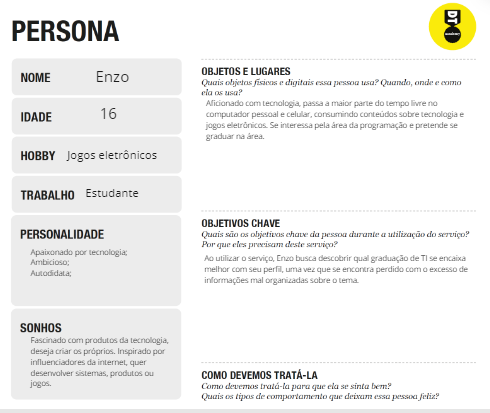

# Informações do Projeto
`TÍTULO DO PROJETO`  

Dificuldade dos jovens em entender as áreas de TI.

`CURSO` 

Engenharia de Software.

## Participantes
> Os membros do grupo são: 
> - Gabriel Herolt Araújo. 
> - Mellyssa Meireles Dos Santos.
> - Miguel Alves Fernandes Moraes.

# Estrutura do Documento

- [Informações do Projeto](#informações-do-projeto)
  - [Participantes](#participantes)
- [Estrutura do Documento](#estrutura-do-documento)
- [Introdução](#introdução)
  - [Problema](#problema)
  - [Objetivos](#objetivos)
  - [Justificativa](#justificativa)
  - [Público-Alvo](#público-alvo)
- [Especificações do Projeto](#especificações-do-projeto)
  - [Personas e Mapas de Empatia](#personas-e-mapas-de-empatia)
  - [Histórias de Usuários](#histórias-de-usuários)
  - [Requisitos](#requisitos)
    - [Requisitos Funcionais](#requisitos-funcionais)
    - [Requisitos não Funcionais](#requisitos-não-funcionais)
  - [Restrições](#restrições)
- [Projeto de Interface](#projeto-de-interface)
  - [User Flow](#user-flow)
  - [Wireframes](#wireframes)
- [Metodologia](#metodologia)
  - [Divisão de Papéis](#divisão-de-papéis)
  - [Ferramentas](#ferramentas)
  - [Controle de Versão](#controle-de-versão)
- [**############## SPRINT 1 ACABA AQUI #############**](#-sprint-1-acaba-aqui-)
- [Projeto da Solução](#projeto-da-solução)
  - [Tecnologias Utilizadas](#tecnologias-utilizadas)
  - [Arquitetura da solução](#arquitetura-da-solução)
- [Avaliação da Aplicação](#avaliação-da-aplicação)
  - [Plano de Testes](#plano-de-testes)
  - [Ferramentas de Testes (Opcional)](#ferramentas-de-testes-opcional)
  - [Registros de Testes](#registros-de-testes)
- [Referências](#referências)

# Introdução

## Problema

 Aproximando-se do período de escolha de graduações, os jovens que se interessam por tecnologia da informação passam por impasse. Existe uma grande dificuldade em entender e diferenciar os tópicos abordados nas graduações, gerada por má informação de toda a comunidade e a falta de organização nos conteúdos explicativos disponibilizados na internet. Além disso, fala-se muito dos cursos "Ciências da Computação" e "Engenharia da Computação", ofuscando os demais cursos, fazendo que os jovens possam acabar optando por um curso que não se identificam tanto.

## Objetivos

Como objetivo geral, nosso trabalho é desenvolver um software que atua como um teste vocacional, auxiliando jovens a entenderem as aréas de TI, direcionando-os para o curso de graduação que mais combina com seu perfil.
 

Para isso, adotamos uma estratégia que consiste em fazer perguntas ao usuário voltadas a área de tecnologia da informação, com o intuito de identificar o seu perfil. Uma vez analisado, pode-se assumir quais atividades o usuário mais se adequa, apresentando-o ao curso que suprirá as expectativas do usuário relacionadas ao conteúdo abordado na graduação.

## Justificativa
Por conta dos integrantes terem passado pelo mesmo problema, foi uma motivação para trabalhar com esta aplicação,com objetivo de auxiliar os jovens a entender qual a área certa para eles.

## Público-Alvo

 Para identificar o nosso público alvo, fizemos entrevistas qualitativas com jovens que se interessam pela área de tecnologia e pretendem cursar a graduação. Após verificar que este grupo de indivíduos passam pelos problemas listados, embasou-se neles os principais alvos da aplicação. Chegou-se a conclusão que os principais alvos são pessoas jovens, entre 14 a 25 anos, que querem aprender sobre tecnologia e demonstram interesse em cursar a graduação ou que já entraram não se identificaram com o curso. Ao se deparar com a dificuldade de definir qual o melhor curso de tecnologia, pessoas com este perfil são potenciais usuários de nossa aplicação.

 
# Especificações do Projeto

Nessa parte do projeto, utilizou-se de várias ferramentas e técnicas para auxiliar na produção do projeto.
 

Dentre elas são:
 

<a href="https://trello.com">Trello</a>, para a produção e manuntenção do quadro <i>Kanban</i>;

<a href="https://Miro.com">Miro</a>, para a produção de mapas mentais, wireframes e o processo de Design Thinking;

<a href="https://git-scm.com/">Git</a>, para o versionamento de código;

<a href="https://github.com/">GitHub</a>, como repositório;

Design Thinking, para captação de ideias do projeto;

Scrum, como metodologia ágil adotada para desenvolvimento do projeto.

## Personas e Mapas de Empatia

Para criação de nossa persona, tomamos como base o perfil médio dos entrevistados que demonstraram interesse no projeto. As características marcantes deste perfil são: Jovens, com interesse em tecnologia e passam parte do tempo livre no computador.

 

A persona criada é idealizada como o cliente de nosso sistema.

## Histórias de Usuários

Com base na análise das personas forma identificadas as seguintes histórias de usuários:

|EU COMO... `PERSONA`| QUERO/PRECISO ... `FUNCIONALIDADE` |PARA ... `MOTIVO/VALOR`                 |
|--------------------|------------------------------------|----------------------------------------|
|Usuário do sistema  | Encontrar qual o curso que me agrada        | Não cursar algo que não irá me agregar|
|Usuário do sistema  | Encontrar faculdades próximas               | Pois são mais acessíveis para mim  |
|Usuário do sistema  | Encontrar faculdades com preços que cabem no meu bolso | Pois não é fácil encontrar estes valores na internet |

## Requisitos

As tabelas que se seguem apresentam os requisitos funcionais e não funcionais que detalham o escopo do projeto.

### Requisitos Funcionais

|ID    | Descrição do Requisito  | Prioridade |
|------|-----------------------------------------|----|
|RF-001| Cadastrar usuário | ALTA | 
|RF-002| Autenticar usuário    | ALTA |
|RF-003| Alterar usuário       | BAIXA |
|RF-004| Formulário para identificar o curso que usuário assemelha | ALTA |
|RF-005| Histórico de formulários respondidos pelo usuário         | MEDIA |
|RF-006| Permitir que o usuário favorite cursos     | BAIXA |
|RF-007| Exibir manchetes de cursos favoritados     | BAIXA |
|RF-008| Exibir manchetes do tema "Cursos de TI     | ALTA |
|RF-009| Exibir universidades que possuem cursos de TI | ALTA |
|RF-010| Permitir a filtragem de universidades por preço | MEDIA |
|RF-011| Permitir a filtragem de universidades por curso | ALTA |
|RF-012| Comparação de preços de faculdades particulares | BAIXA |
|RF-013| Listagem dos cursos de TI com uma breve descrição | ALTA |

### Requisitos não Funcionais

|ID     | Descrição do Requisito  |Prioridade |
|-------|-------------------------|----|
|RNF-001| O sistema deve ser responsivo para rodar em um dispositivos móvel | MÉDIA | 
|RNF-002| Deve processar requisições do usuário em no máximo 3s |  BAIXA | 
|RNF-003| Base de dados que relaciona curso com perfil do usuário | ALTA |

## Restrições

O projeto está restrito pelos itens apresentados na tabela a seguir.

|ID| Restrição                                             |
|--|-------------------------------------------------------|
|01| O projeto deverá ser entregue até o final do semestre |
|02| Não pode ser desenvolvido um módulo de backend        |

# Projeto de Interface

 O Projeto de Interface fora feito utilizando a ferramenta de planejamento de projeto <a href=“https://miro.com/“>Miro</a>. Nesta etapa, busca-se atender os requisitos funcionais e não funcionais especificados nas [Especificações do Projeto](#especificações-do-projeto), utilizando-se dos dados coletados nas pesquisas qualitativas. Para isso, fez-se útil o User Flow, mapeando a atividade do usuário dentro da aplicação, e os wireframes, que ajudam a dar uma pré-visualização da solução a ser desenvolvida.

 

 Pensando na dificuldade do usuário em encontrar dados sobre cursos da área de TI na internet, fez-se uma prototipação focada em dar informações diretas e separadas por curso, além de uma ferramenta para auxiliar o usuário a definir qual curso melhor se encaixa ao seu perfil.

## User Flow

**User Flow Principal:**

 Pelo User Flow de toda aplicação, é possivel perceber que, ao acessar o site, permite-se quatro principais caminhos: Cursos, universidades, formulário e autenticação.

 No caminho de cursos, é possivel ver uma listagem dos cursos da área de TI e, se autenticado, favoritar os que mais interessam ao usuário.

 No de universidades, são listadas universidades que oferecem os cursos da área de TI, possibilitando o usuário filtrar por curso e preço.

 No de autenticação, possuí as funções de login, cadastro e edição de perfil.

**User Flow do Formulário:**

 Por ser mais extenso, fora feito um User Flow apenas para o processo de formulário. É possivel verificar que, respondidas as perguntas solicitadas, o sistema, com base nas respostas, indicará o usuário qual o curso que mais se assemelha ao seu perfil, exibindo manchetes e informações sobre. Após a leitura, o usuário poderá informar ao sistema que aquele curso não o agrada, gerando-se um novo.

## Wireframes

**Tela inicial:**

Esta é a tela inicial do projeto. Contém um header navigation, com a função de navegar por toda aplicação. A tela inicial possui um carrousel, que destacará as principais notícias da área, e manchetes sobre cursos de TI.

**Notícias**

A tela de notícias ainda está dentro da tela inicial. Ao clicar no botão "Notícias" no header, o usuário será direcionado a seção de manchetes.

**Cursos**

Nesta tela, acessada pelo botão "Cursos" no header, será apresentado ao usuário uma lista de cursos com uma breve descrição. O usuário pode favoritar ou desfavoritar cursos.

**Curso**

Ao selecionar um curso na tela de cursos, o usuário será redirecionado para uma nova tela, que detalhará melhor o curso escolhido e dará a opção de ver universidades que o oferecem.

**Universidades**

Clicando em "Universidades" do header, esta tela será exibida, listando todas universidades que oferecem cursos de TI. Também será possível filtrar as universidades exibidas por curso e preço. Ao clicar em uma universidade, o usuário será redirecionado para o site da instituição.

**Formulário**

Nesta página, também acessada pelo header, o usuário responderá perguntas e, com base nas respostas, o sistema encontrará um curso que se assemelha ao perfil do usuário.

**Resultado do Formulário**

Ao preencher todo o formulario e clicar em enviar, o sistema definirá o curso que aparenta ser do gosto do usuário e o encaminhará para uma página com os dados do curso. Esses dados são: uma breve descrição e manchetes do curso ou universidades que o oferecem.

Clicando em "Me dê outro curso", o sistema retornará outro curso que se assemelha ao perfil obtido no formulário.

**Login**

Ao clicar no botão de perfil do header, se o usuário não estiver autenticado no sistema, será redirecionado à pagina de login.

**Cadastro**

Selecionando-se "Cadastre-se" na tela de login, o usuário será redirecionado a tela de cadastro.

**Perfil**

Autenticado, o usuário poderá selecionar "Ver conta" no menu de usuário. Clicando, exibirá uma tela com as informações da conta e cursos favoritados.

**Histórico**

Ao selecionar "Últimos Formulários" no menu de usuário, exibirá uma tela com os ultimos resultados recebidos do formulário. Ao selecionar um, será exibido a tela "Resultado do Formulário" do curso selecionado.

# Metodologia

Antes da iniciação do desenvolvimento, utilizou-se o processo de Design Thinking para delimitar as necessidades dos usuários, criando-se uma persona principal para o nosso projeto. Uma vez criada, a persona facilita a prototipação do projeto, tornando-se palpável a criação de designs que agradam o usuário final.

Para a realização do trabalho, adotamos a metodologia SCRUM. Para cada tarefa, designamos a dificuldade de execução, definindo-se um prazo relativo à dificuldade. Para cada funcionalidade, faz-se uma reunião com um consumidor para validar a necessidade da funcionalidade.

Para incrementar o SCRUM, utilizou-se do método Kanban, para se ter uma melhor visualização das tarefas e seus atuais estados. Para a metodologia ágil Kanban, estamos utilizando a ferramenta <a href="https://Trello.com">Trello</a>

## Divisão de Papéis

Para a divisão de papéis, utiliza-se a pontuação de dificuldade de cada tarefa definida na metodologia Scrum. Dividiu-se as tarefas em grupos de pontuações similares, e cada integrante ficou responsável por um destes grupos de tarefas.

## Ferramentas

 O editor de código escolhido foi o VsCode. Além de ter extensões compatíveis com HTML e CSS, possuí também ferramentas para visualizar o controle de versão e o Git Flow.

 Para comunicação, estamos utilizando o Trello. Por meio de um quadro Kanban as tarefas são dividias, permitindo que todos possam documentar o seu progresso nas tarefas.

 Na diagramação, utilizamos o Miro. Por ser uma ferramenta que possibilita a criação de fluxogramas, wireframes e outros processos de prototipação, escolhemos o Miro a fim de salvar tempo e melhorar a produtividade, uma vez que dominando a ferramenta é possivel realizar toda a etapa prototipação.

 Como hospedagem, escolhemos o Heroku, que, além de ser gratuito, permite a conexão direta com o github sem muita burocracia.

| Ambiente  | Plataforma              |Link de Acesso |
|-----------|-------------------------|---------------|
|Processo de Design Thinkgin  | Miro |  https://miro.com/app/board/uXjVOA3Il1A=/ | 
|Repositório de código | GitHub | https://github.com/ICEI-PUC-Minas-PPLES-TI/plf-es-2022-1-ti1-7946100-01-g5-entedimento-das-areas-de-ti/blob/master/docs/relatorio/Relatorio%20Tecnico%20-%20TEMPLATE.md#projeto-de-interface | 
|Hospedagem do site | Heroku |  https://entedimento-das-areas-de-ti.herokuapp.com/ | 
|Protótipo Interativo | Miro | https://miro.com/app/board/uXjVO7xkYGI=/ | 

## Controle de Versão

 Para o controle de versão, adotamos o [Git](https://git-scm.com/), permitindo que a equipe trabalhe, dentro do projeto, de forma assíncrona. Para evitar conflitos durante a mescla de arquivos, adotaremos a ramificação, permitindo que versões paralelas do projeto sejam criadas, facilitando a divisão do código que está em processo de testes e melhorias e do que está em produção.

Adotaremos a seguinte convenção para branchs:
 
 - `master`: versão estável já testada do software 
 - `unstable`: versão já testada do software, porém instável 
 - `testing`: versão em testes do software 
 - `dev`: versão de desenvolvimento do software 

E para etiquetas:
 
 - `bugfix`: uma funcionalidade encontra-se com problemas 
 - `enhancement`: uma funcionalidade precisa ser melhorada 
 - `feature`: uma nova funcionalidade precisa ser introduzida 

# **############## SPRINT 1 ACABA AQUI #############**

# Projeto da Solução

## Tecnologias Utilizadas

No nosso projeto, utilizamos html, css, bootsrap, php, javascript manipulando json e jquery.
O json manipulado foi usado para armazenar dados em localstorage.

Assim que o usuário entra no site ele é direcionado para fazer o login ou, caso precise, se registrar.

Na página principal o usuário poderá procurar por cursos e universidades, ver notícias e preencher um formulário para descobrir qual curso é o mais adequado.
## Arquitetura da solução
- Navegador - Interface básica do sistema
  - Páginas Web  (arquivos HTML, CSS, JavaScript)
  - Local Storage - armazenamento mantido no Navegador do usuário, bancos de dados baseados em JSON.
    - Registro de dados do usuário
- Hospedagem - github/hiroku
# Avaliação da Aplicação

......  COLOQUE AQUI O SEU TEXTO ......

> Apresente os cenários de testes utilizados na realização dos testes da
> sua aplicação. Escolha cenários de testes que demonstrem os requisitos
> sendo satisfeitos.

## Plano de Testes

|ID    | Descrição |  Página referente      |
|------|-----------------------------------------|---|
|Teste 01| Cadastrar usuário | Página de login/cadastro |
|Teste 02| Acessar página de cursos   | Página de cursos |
|Teste 03| Pesquisar universidades   | Qualquer página |
|Teste 04| Ver manchetes  | Página notícias |

## Ferramentas de Testes (Opcional)

- Ferramentas do próprio navegador 
- UX Tools
- Google Lighthouse

> Comente sobre as ferramentas de testes utilizadas.
> 
> **Links Úteis**:
> - [Ferramentas de Test para Java Script](https://geekflare.com/javascript-unit-testing/)
> - [UX Tools](https://uxdesign.cc/ux-user-research-and-user-testing-tools-2d339d379dc7)

## Registros de Testes

......  COLOQUE AQUI O SEU TEXTO ......

> Discorra sobre os resultados do teste. Ressaltando pontos fortes e
> fracos identificados na solução. Comente como o grupo pretende atacar
> esses pontos nas próximas iterações. Apresente as falhas detectadas e
> as melhorias geradas a partir dos resultados obtidos nos testes.

# Referências

......  COLOQUE AQUI O SEU TEXTO ......

> Inclua todas as referências (livros, artigos, sites, etc) utilizados
> no desenvolvimento do trabalho.
> 
> **Links Úteis**:
> - [Formato ABNT](https://www.normastecnicas.com/abnt/trabalhos-academicos/referencias/)
> - [Referências Bibliográficas da ABNT](https://comunidade.rockcontent.com/referencia-bibliografica-abnt/)
